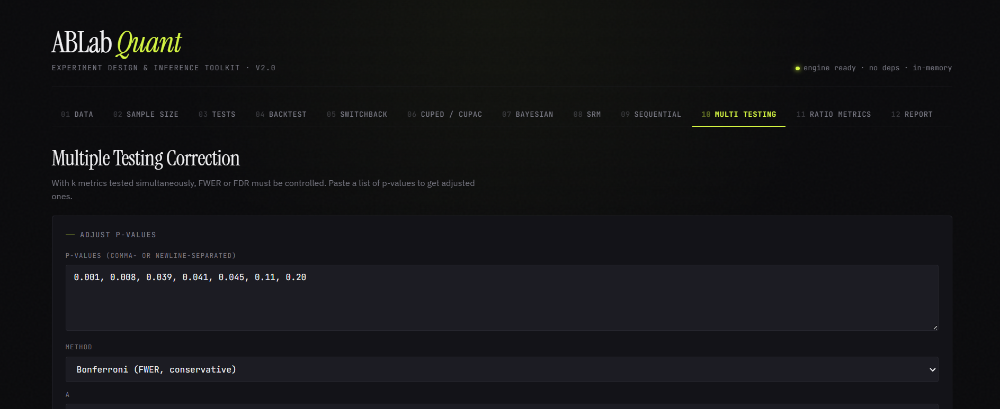

# ABLab Quant

> Self-contained A/B testing toolkit for quantitative experiment design and inference. Vanilla JS, zero dependencies, works in browser or as desktop app.

[](https://gobberz.github.io/ablab/)
[](LICENSE)
[](https://tauri.app)

**[Live demo →](https://gobberz.github.io/ablab/)**  ·  **[Download desktop app →](../../releases/latest)**

---



## What it does

12 modules covering the full A/B experiment lifecycle, from design to inference:

| # | Module | Purpose |
|---|---|---|
| 01 | **Data** | CSV upload / manual summary / synthetic generator (Normal, Lognormal, Bernoulli, Poisson) with optional pre-period covariate |
| 02 | **Sample Size** | Power analysis for means and proportions, reverse MDE, power curves |
| 03 | **Tests** | Welch, Student, Mann-Whitney U, z-test for proportions, χ², bootstrap |
| 04 | **Backtest** | A/A simulation with empirical FPR, KS test vs uniform, p-value histogram |
| 05 | **Switchback** | Block design planner with permuted/Bernoulli/Latin-square randomization, carryover buffer |
| 06 | **CUPED / CUPAC** | Variance reduction via pre-experiment covariate, with effective sample size boost |
| 07 | **Bayesian** | Beta-Binomial and Normal-Normal posteriors, P(B>A), expected loss, credible intervals |
| 08 | **SRM** | Sample Ratio Mismatch χ² check (industry threshold 0.0005) |
| 09 | **Sequential** | SPRT (Wald) with LLR boundaries and expected sample size |
| 10 | **Multiple Testing** | Bonferroni, Holm, Benjamini-Hochberg, Benjamini-Yekutieli |
| 11 | **Ratio Metrics** | Delta method for ratio estimators with covariance term |
| 12 | **Report** | Markdown / JSON export of run log |

## Why

Most A/B tools are either (a) SaaS with vendor lock-in, (b) Python notebooks that don't deploy, or (c) Excel templates that hide the math. This is a single HTML file with hand-rolled implementations of all the statistical primitives — runs offline, embeds in any portfolio site, no analyst dependencies.

Built as a learning + reference tool for quantitative product analytics. Statistical functions are unit-tested against textbook values:
- `normCDF(1.96) = 0.9750`
- `tCDF(2.228, df=10) = 0.9750`
- `χ²CDF(3.84, df=1) = 0.9500`
- `sampleSizeCont(σ=20, MDE=2) = 1570 per group`

## Quick start

### Browser (zero install)
Open [`src/index.html`](src/index.html) directly, or visit the [hosted demo](https://gobberz.github.io/ablab/).

### Desktop app
Download the installer for your OS from [Releases](../../releases/latest):
- **Windows** — `ABLab_x.y.z_x64-setup.exe` (~8 MB)
- **macOS** — `ABLab_x.y.z_universal.dmg`
- **Linux** — `ablab_x.y.z_amd64.AppImage`

Built with [Tauri](https://tauri.app) — uses the system webview, so the binary stays small.

### Build from source

```bash
git clone https://github.com/Gobberz/ablab.git
cd ablab

# Just the web app — open in browser
open src/index.html

# Desktop app
npm install
npm run tauri dev      # development mode
npm run tauri build    # produce installer in src-tauri/target/release/bundle/
```

## Repository layout

```
ablab/
├── src/                  # Static web app (single HTML, no build step)
│   ├── index.html        # Entry point for GitHub Pages
│   └── ablab.html        # Same file, canonical name
├── src-tauri/            # Tauri desktop wrapper (Rust)
│   ├── src/main.rs
│   ├── tauri.conf.json
│   └── icons/
├── examples/             # Sample CSV files for testing
│   └── sample_experiment.csv
├── docs/                 # User guide and statistical notes
│   └── USAGE.md
├── .github/workflows/    # CI: deploy Pages, build desktop binaries
└── README.md
```

## Statistical implementations

All distributions and tests are implemented from scratch in vanilla JavaScript — no `jStat`, no `simple-statistics`. This keeps the bundle at ~90 KB and makes the math auditable.

- **Normal CDF** — Abramowitz-Stegun erf approximation
- **Inverse Normal** — Beasley-Springer-Moro
- **Student's t / F / χ²** — via regularized incomplete beta and gamma (continued fractions, Lanczos for log Γ)
- **Beta sampling** — ratio of two Marsaglia-Tsang gamma deviates
- **RNG** — `mulberry32`, seedable for reproducible backtests

Sanity-checked against textbook values; see test cases in commit history.

## Contributing

PRs welcome. If you find a stat function disagreeing with R/SciPy by more than 1e-4, please file an issue with the input.

## License

MIT — see [LICENSE](LICENSE).

## Author

Built by [Artur Shaimardanov](https://gobberz.com) — Senior Data/Product Analyst at a quant trading fund.

If this is useful in your work, a star on the repo is appreciated. If you're hiring product/data analysts, [LinkedIn](https://linkedin.com/in/gobberz).
